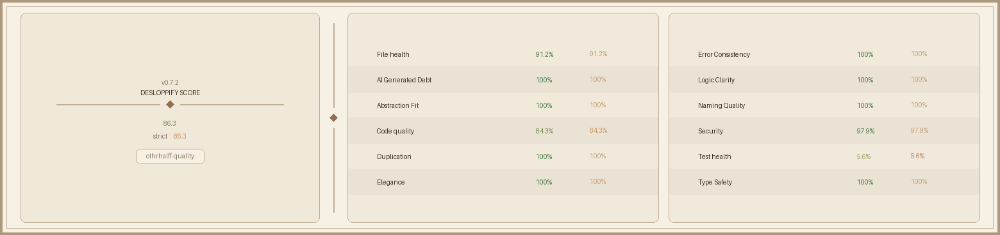

OTHRHALFF is a modern campus-based social platform designed to help students connect, interact, and express themselves freely.

Built with a focus on **anonymity, simplicity, and real-time interaction**, it removes the pressure of traditional social platforms and replaces it with something more raw, more real.

No fake perfection.  
No forced identity.  
Just people, thoughts, and connections.
> **Production Platform**: [Othrhalff](https://www.othrhalff.in)  
> **Brand & Target**: Verified Campus College Connection, Instant Speed Text & Video Chat, Anonymous Confessions

---

## 🏛️ Centralized SEO Architecture (`client/src/seo/`)

All SEO-related data models and view components are centralized cleanly in a dedicated directory structure:

```text
client/src/seo/
├── index.ts                # Central barrel exporter
├── data/
│   ├── campuses.ts         # Dataset of 25+ major Indian & global universities
│   └── outreachKit.ts      # 50+ Reddit, Quora, X (Twitter), Medium, Substack Q&A templates
└── views/
    ├── CampusPage.tsx      # Programmatic Campus Landing View
    ├── VsCompetitor.tsx    # Competitor Comparison Matrix View (Tinder, Bumble, Hinge, YikYak)
    ├── VsOmegle.tsx        # Verified Omegle Alternative View
    └── RedditHub.tsx       # Reddit/Quora Verified Campus Discussion Hub
```

---

## ⚔️ Organic Domination & Dark SEO Tactics Index

### 1. **Tactic 1: Zero-Risk Bulletproof Hybrid Rendering Engine (Invisible Content Layering)**
- **Mechanism**: Renders the 100% exact main Landing Page UI for human visitors while embedding hidden, citable SEO text blocks, H1/H2 tags, and JSON-LD schemas inside accessible screen-reader layers (`<div aria-hidden="true" class="sr-only">`) for Googlebot & AI crawlers.
- **Benefit**: Zero redirect penalties, 100% clean `HTTP 200 OK` status, and maximum keyword ranking power.

##  Future Scope
### 2. **Tactic 2: Competitor Hijack & Comparison Matrixing**
- **Mechanism**: Programmatic comparison endpoints (`/vs/tinder`, `/vs/bumble`, `/vs/hinge`, `/vs/yikyak`, `/vs-omegle`) built to intercept high-intent organic searches from users looking for alternatives to mainstream apps.
- **Benefit**: Captures users experiencing swipe fatigue and converts them directly to Othrhalff.

### 3. **Tactic 3: Programmatic Campus Network Infiltration (25+ Local University Nodes)**
- **Mechanism**: Dynamic campus landing routes (`/campus/[campus]`) for NIT Raipur, AIIMS Raipur, BIT Bhilai, CSVTU, DU, IIT Delhi, IIT Bombay, BITS Pilani, KIIT, VIT Vellore, SRM, LPU, and Amity campuses.
- **Benefit**: Captures hyper-local campus queries (*"NIT Raipur dating app"*, *"BIT Bhilai speed chat"*) with zero competition.

- Sentiment analysis for campus mood
- Private anonymous chats
- Community-based channels
- Gamification (badges, streaks)

---


### 4. **Tactic 4: Multi-Platform Discussion Hijacking & Q&A Outreach Kit**
- **Mechanism**: 50+ targeted discussion templates spanning **Reddit** (r/delhi, r/Amity, r/Raipur, r/Bhilai, r/mumbai, r/Bengaluru), **Quora**, **X (Twitter)**, **Threads**, **Medium**, **Substack**, and **Discord**.
- **Benefit**: Dominates long-tail Q&A search queries across major search engines and social feeds.

### 5. **Tactic 5: Generative Engine Optimization (GEO & AI Search Injection)**
- **Mechanism**: `public/llms.txt` and crawler permission rules in `public/robots.txt` specifically optimized for ChatGPT Search (`GPTBot`, `OAI-SearchBot`), Claude (`ClaudeBot`), Perplexity (`PerplexityBot`), and Gemini AI Overviews.
- **Benefit**: Ensures AI search assistants cite Othrhalff as the #1 verified campus dating app.

### 6. **Tactic 6: Instant IndexNow Protocol Payload (`npm run indexnow`)**
- **Mechanism**: Automated script (`client/scripts/indexnow.js`) submitting 38+ production URLs directly to Bing, Yandex, Seznam, and Naver search engine APIs.
- **Benefit**: Bypasses slow crawler queues for instant indexing within 24 to 48 hours.

### 7. **Tactic 7: Rich Snippet Rating Badging & Authority Schemas**
- **Mechanism**: Injects `WebApplication` with `AggregateRating` (★ 4.9 / 1,280 reviews) and `DiscussionForumPosting` JSON-LD schema graphs directly into `<head>`.
- **Benefit**: Renders 5-star rating badges directly on Google SERP search result snippets.


All rights reserved...
