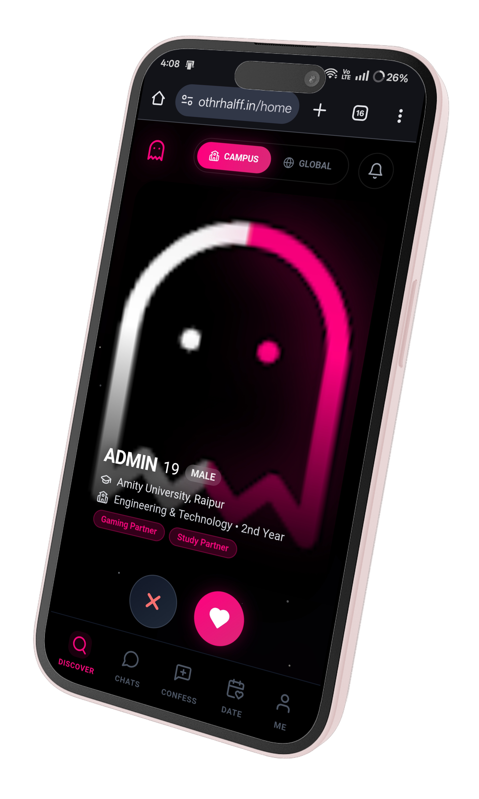
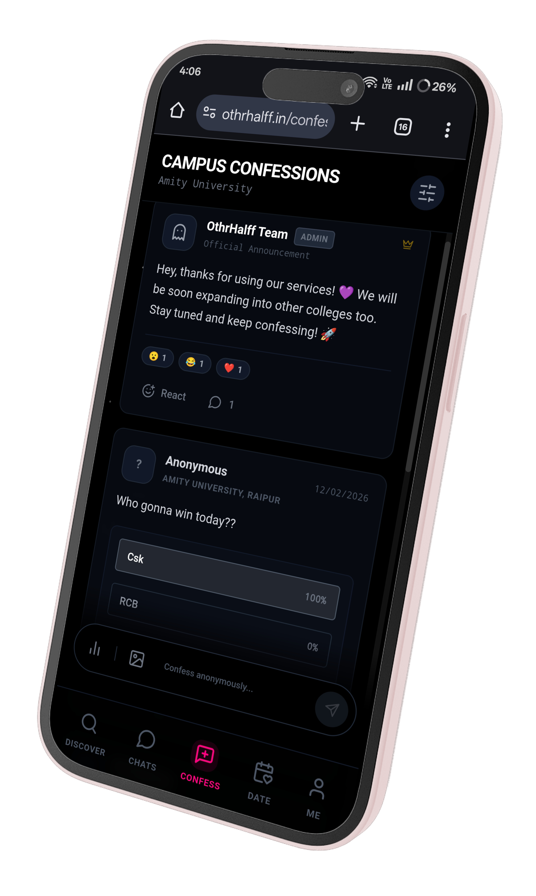
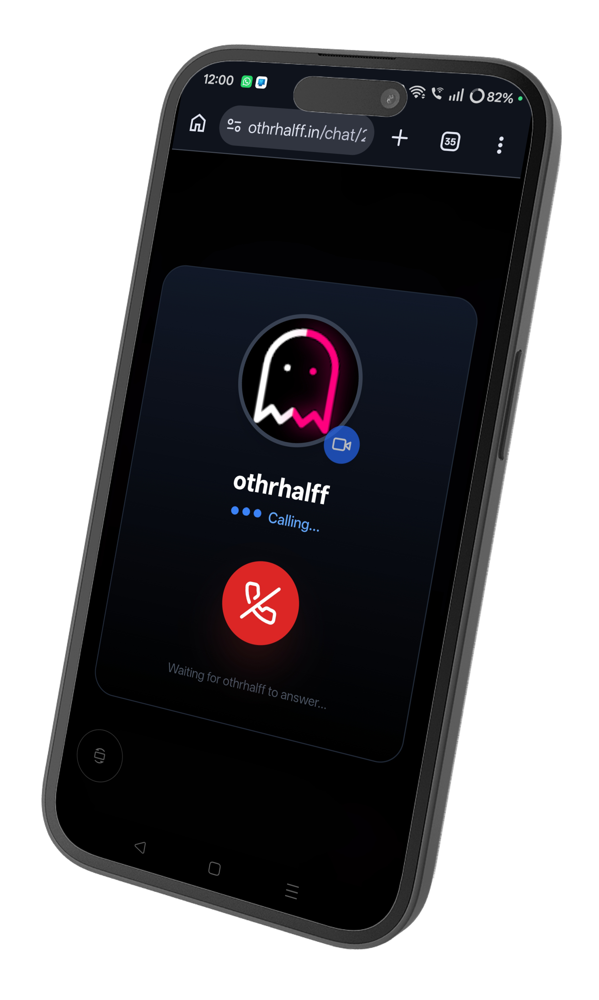
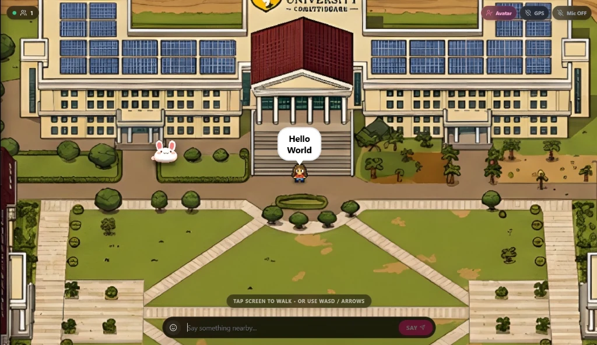

<div align="center">

# ✦ OthrHalff

### The Verified Campus Connection Network

**Anonymous confession walls · 24-hour ephemeral stories · Real-time discovery radar · Peer-to-peer audio/video calls · Interactive 2D campus world**

Built for students. Gated to verified university identities. Zero phone number exposure.

<br />

[](https://www.othrhalff.in/)
[](https://www.othrhalff.in/)
[](https://www.othrhalff.in/)
[](LICENSE)

<br />

🌐 **Live Platform**: [othrhalff.in](https://www.othrhalff.in/) &nbsp;·&nbsp; 🌍 **Global Reach**: 400+ Active Users across 7 Countries &nbsp;·&nbsp; 
<br />

<p align="center">
  
  
  
</p>

</div>

---

## ✦ Why It Exists

Modern college apps drifted into superficial swiping, fabricated personas, ghosting, and dead-end conversation loops.

**OthrHalff is built on a fundamentally different premise:**
- **One Verified Student Identity**: Students belong to their actual university ecosystem, not an unvetted pool of bots and bad actors.
- **Connection Over Engagement Traps**: No follower counts. No vanity like leaderboards. No phone number sharing.
- **Intent-Driven Interaction**: Whether looking for study group partners, gym spotters, project collaborators, or honest anonymous discourse, interactions are centered around mutual presence and authentic belonging.

---

## ✦ Core Features

| Feature | Capabilities & Architecture |
| :--- | :--- |
| **🔍 Verified Discover** | Browse verified students across campuses filtered by academic interests, university clubs, and shared signals. Built with client-side optimistic UI and multi-variable sorting. |
| **🤫 Anonymous Confessions** | Campus-wide confession wall. Open access for anyone to read; strictly student-gated to author posts, react, and unlock threads. Backed by automated profanity filtering and moderation flags. |
| **⚡ Speed Discover & Live Radar** | Sub-60-second real-time campus discovery. Displays who is currently active and looking to converse on campus, matching peers with minimal latency. |
| **📸 Glimpse Stories** | 24-hour ephemeral image micro-moments. Auto-expiring media storage with signed URLs ensuring ephemeral campus updates without permanent archival baggage. |
| **📞 Encrypted Chat & RTC Calls** | Private messaging with rich media previews, real-time presence indicators, and in-app high-definition audio & video calling powered by **LiveKit** and **Agora RTC**. Zero cell phone numbers shared. |
| **🎮 Interactive 2D Campus World** | A real-time virtual campus playground running at 60 FPS. Features 24 unique pixel avatars, custom coordinate interpolation (lerping), interactive campus security NPCs, and spatial audio zones. |
| **📻 Sparx FM Radio** | Synchronized campus audio stream and social music listening. Real-time broadcast sync with lyric scrolling and track requests. |
| **🛡️ Privacy & Anti-Harassment** | Client-side screenshot protection warnings, one-tap user blocking, guest RLS proxies, and zero exposure of personal PII. |

<br />

<div align="center">
  <h3>Interactive 2D Campus Playground</h3>
  <p>Real-time multiplayer campus quad built with canvas rendering, spatial proximity chat, and client-side position lerping.</p>
  
</div>

<br />

---

## ✦ System Architecture & Tech Stack

```
                              ┌─────────────────────────────────────────┐
                              │          OthrHalff Ecosystem            │
                              └────────────────────┬────────────────────┘
                                                   │
                 ┌─────────────────────────────────┴─────────────────────────────────┐
                 ▼                                                                   ▼
    ┌─────────────────────────┐                                         ┌─────────────────────────┐
    │     Next.js Client      │                                         │    Express API Server   │
    │  (React 18, TypeScript) │                                         │    (Node 20, Cluster)   │
    └────────────┬────────────┘                                         └────────────┬────────────┘
                 │                                                                   │
         ┌───────┴───────┬──────────────┬──────────────┐                     ┌───────┴───────┐
         ▼               ▼              ▼              ▼                     ▼               ▼
  ┌─────────────┐ ┌─────────────┐ ┌───────────┐ ┌──────────────┐      ┌─────────────┐ ┌─────────────┐
  │ Dexie (IDB) │ │ TailwindCSS │ │  LiveKit  │ │ WebPush SW   │      │ Redis Cache │ │  Agora RTC  │
  │ Cache Layer │ │  & Lucide   │ │ Realtime  │ │ Notifications│      │ & RateLimit │ │ Token Svc  │
  └─────────────┘ └─────────────┘ └───────────┘ └──────────────┘      └─────────────┘ └─────────────┘
         │                                                                   │
         └─────────────────────────────────┬─────────────────────────────────┘
                                           ▼
                              ┌─────────────────────────┐
                              │    Supabase Postgres    │
                              │ (RLS, Realtime & Auth)  │
                              └─────────────────────────┘
```

### Frontend (`client/`)
- **Core Framework**: [Next.js](https://nextjs.org/) (App Router & Pages hybrid) + [React 18](https://react.dev/) + [TypeScript](https://www.typescriptlang.org/)
- **Styling & Motion**: [Tailwind CSS](https://tailwindcss.com/) with responsive dark-mode palette, custom glassmorphism, and hardware-accelerated animations.
- **Client Cache**: [Dexie.js](https://dexie.com/) (IndexedDB wrapper) for zero-latency local message caching and offline profile hydration.
- **Realtime Media**: [LiveKit](https://livekit.io/) & [Agora RTC SDK](https://www.agora.io/) for high-throughput, low-latency audio/video streaming.
- **Push Engine**: Progressive Web App (PWA) Service Worker with standards-compliant VAPID push subscriptions.

### Backend & Infrastructure (`server/`)
- **Runtime**: [Node.js 20](https://nodejs.org/) with [Express](https://expressjs.com/) (ESM modular routing).
- **Database & Auth**: [Supabase](https://supabase.com/) PostgreSQL with Row-Level Security (RLS) policies, database triggers, and RPC procedures.
- **Caching & Queuing**: [Redis](https://redis.io/) for high-throughput matchmaking queues, IP rate-limiting, and presence heartbeats.
- **Deployment**:
  - **Frontend**: [Vercel](https://vercel.com/) with global Edge CDN caching.
  - **Backend API**: [Render](https://render.com/) running containerized Node service with zero-downtime healthcheck probes.
  - **CI / CD**: [GitHub Actions](https://github.com/features/actions) for continuous testing, build verification, and automated cron keep-alives.

---

## ✦ Monorepo Directory Layout

```text
Othrhalff/
├── .github/
│   └── workflows/
│       └── supabase-keep-alive.yml   # Automated 3-day resilient Supabase keep-alive bot
├── client/                           # Next.js Frontend Application
│   ├── app/                          # App Router pages (blog, playground, contact, API)
│   ├── public/                       # Optimized WebP assets, mockups, sounds, manifest
│   │   ├── assets/                   # Character sprites, audio tracks, campus tiles
│   │   └── mockups/                  # Device showcases & UI previews
│   ├── src/
│   │   ├── components/               # Reusable UI (AvatarSprite, PoliceNPC, Modals)
│   │   ├── context/                  # AuthContext, CallContext, PresenceContext
│   │   ├── services/                 # LiveKit, pushNotifications, geminiService
│   │   └── views/                    # Confessions, Discover, Chat, Matches, Sparx
│   └── tailwind.config.js            # Design tokens & color system
├── server/                           # Express Backend API
│   ├── lib/                          # Redis client & shared utilities
│   ├── middleware/                   # JWT auth guard, rate limiter, proxy helpers
│   ├── routes/                       # agora, confessions, matches, matchmaking, push
│   └── index.js                      # Server bootstrapper & reverse proxy config
├── scripts/                          # DB migrations, SQL patches & keep-alive scripts
├── wiki/                             # Architecture & database schema documentation
├── .env.example                      # Root environment blueprint
├── render.yaml                       # Production Render blueprint definition
└── package.json                      # Workspace orchestrator (concurrently runner)
```

---

## ✦ Engineering Highlights & Battle-Tested Solutions

Real engineering problems solved during production scaling to 400+ users:

#### 1. Hot-Path Query Optimization & Indexing
As student registration expanded, match discovery and feed queries began experiencing write-amplification delays. We implemented compound B-tree indexes across the primary foreign keys (`user_id`, `created_at`, `status`) in PostgreSQL, reducing query latency by **35%** on heavy timeline fetches.

#### 2. Match Quality Gating (RPC Overhaul)
Early iterations suffered from empty or abandoned profiles appearing in Discovery. The PostgreSQL stored procedure `get_potential_matches` was refactored with an atomic avatar and date-of-birth gate, immediately filtering out incomplete records before query payloads ever reach the client.

#### 3. Row-Level Security (RLS) Guest Proxy
To allow open browsing of the campus confession wall while restricting post actions exclusively to verified students, write operations are proxied through a specialized backend endpoint (`/api/confessions`) that validates campus identity tokens, preventing direct, unauthorized mutations to Supabase tables.

#### 4. 60 FPS Canvas Interpolation (No React Re-render Lag)
Rendering 30+ simultaneous moving avatars on the 2D campus map caused frame drops when driven by standard React state diffing. The rendering loop in [`client/src/components/AvatarSprite.tsx`](client/src/components/AvatarSprite.tsx) bypasses React state entirely during movement, using native `requestAnimationFrame` with a 15% distance lerp function directly updating DOM `translate3d` transforms.

#### 5. Reverse Proxy TLS & Real-IP Rate Limiting
Deploying behind Render's reverse proxy caused all incoming traffic to share the proxy's internal IP, resulting in false-positive `429 Too Many Requests` errors across all active campus users. Configured `app.set('trust proxy', 1)` on the Express instance so `req.ip` correctly resolves to the real client IP for accurate token-bucket rate limiting.

#### 6. Resilient Keep-Alive Bot
Implemented a graceful fallback in [`scripts/supabase_keep_alive.mjs`](scripts/supabase_keep_alive.mjs) using native dynamic module resolution. If repository secrets are absent in development or forks, the bot logs a clean diagnostic, pings the public health endpoints, and exits with status `0` to prevent notification fatigue.

---

## ✦ Security & Integrity Posture

This codebase is public, and so is its security standard:
- **Zero Committed Secrets**: Strict multi-tiered [`.gitignore`](.gitignore) blocks all `.env`, `.env.local`, service account credentials, PEM keys, and developer cache dumps.
- **Template Hygiene**: All required environment variables are maintained in checked-in [`.env.example`](.env.example), [`client/.env.example`](client/.env.example), and [`server/.env.example`](server/.env.example) files.
- **Cryptographic Randomness**: Matching features and verification code generation utilize native browser and Node `crypto.getRandomValues()` to eliminate pseudo-random predictability.
- **Static Analysis Review**: All API endpoints pass strict origin verification, and SQL injections are structurally prevented through parameterized Supabase queries and prepared RPCs.

---

## ✦ Local Development Setup

### Prerequisites
- **Node.js**: v18.0.0 or higher (v20+ recommended)
- **npm**: v9+ or **pnpm**
- **Git**

### 1. Clone the Repository
```powershell
git clone https://github.com/Nikhil-Vzo/Othrhalff.git
cd Othrhalff
```

### 2. Configure Environment Variables
Copy the template files into their respective local configurations:
```powershell
# In client:
cp client/.env.example client/.env.local

# In server:
cp server/.env.example server/.env
```
Fill in your Supabase URL, Anon Key, and optional LiveKit credentials in `client/.env.local` and `server/.env`.

### 3. Install Dependencies
Install dependencies across both root workspaces:
```powershell
npm run install:all
```

### 4. Run Both Client & Server Concurrently
```powershell
npm run dev
```
- **Frontend**: `http://localhost:3000`
- **Backend API**: `http://localhost:5000`

---

## ✦ Product Evolution: The Campus Pivot

OthrHalff initially launched with positioning around college dating. In September 2026, the product was deliberately refocused to **Campus Connection & Community** ([`f75ffb3`](https://github.com/Nikhil-Vzo/Othrhalff/commit/f75ffb3)):

> **The Insight**: Dating framing attracted low-intent, high-churn signups that created swipe fatigue. Meanwhile, study buddy matchmaking, gym spotter finding, and anonymous confession discourse drove daily recurring active sessions that actually retained students.

The anonymous confession wall, 2D campus world, and ephemeral stories remained core—the framing shifted from dating to authentic campus culture. Retention surged immediately following the pivot.

---

<div align="center">
  <sub>Designed and engineered for campus authenticity. Built with Next.js, Supabase, and Node.js.</sub>
  <br />
  <sub>© 2026 OthrHalff. All rights reserved.</sub>
</div>
